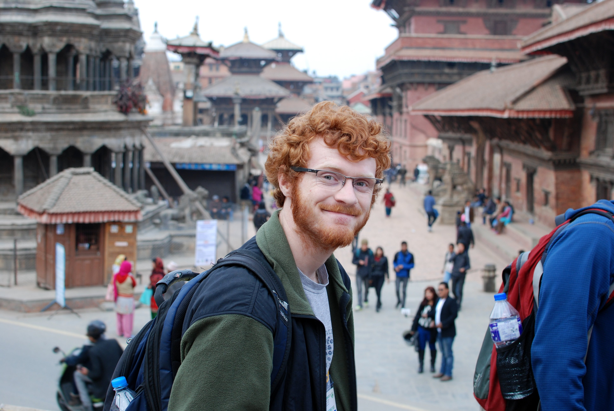
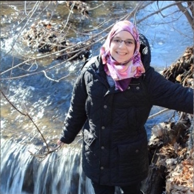
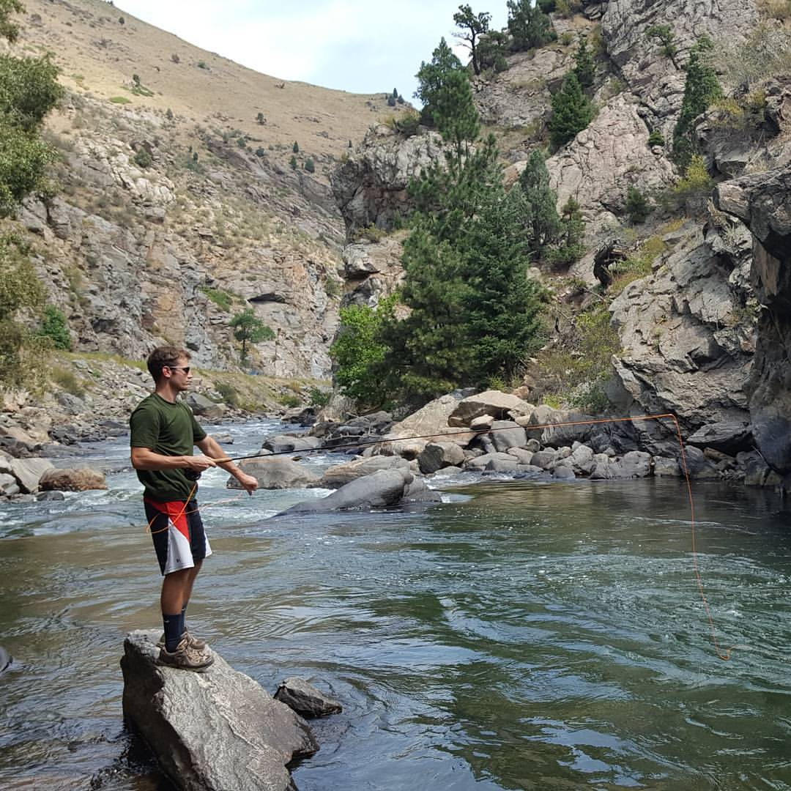
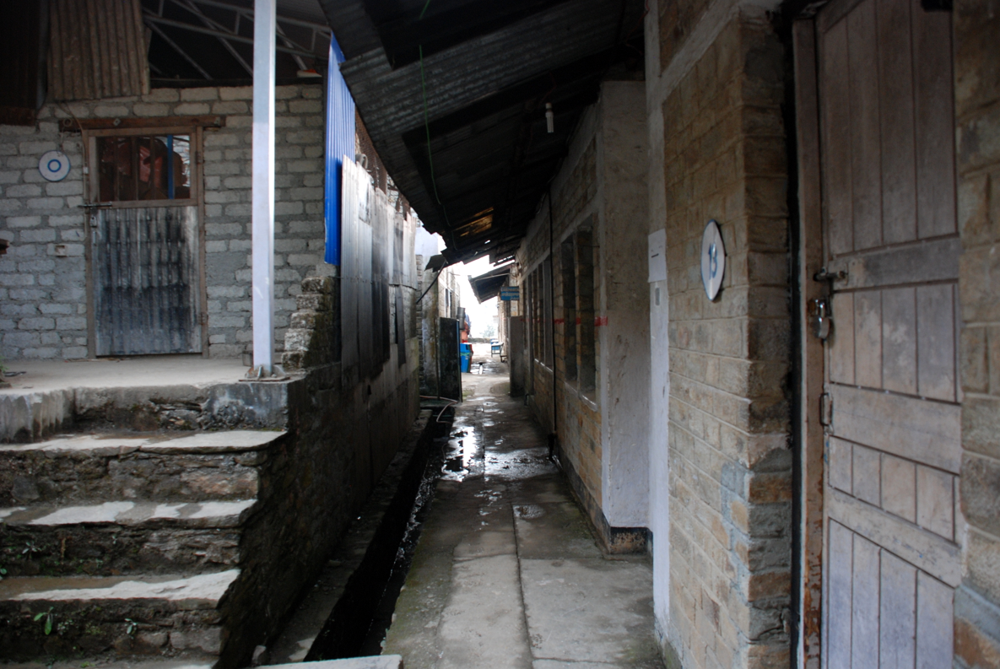

## Welcome Back!!!

Whether you're new to UT, TEWH, or are a long-time member, we're excited to
have you here.

## What's TEWH All About?

. . .

- Investigate, understand, and develop solutions for challenges in
  developing world medical environments

. . .

- Create innovative solutions using engineering first principles

. . .

- Teach practical engineering skills

. . .

- Have a ton of fun working with each other, developing new skills, and making
  new friends!

# Who Are We?

## Reece Stevens (President)

{width=50%}

- Major: Biomedical Engineering

- Year: Senior

- Fun fact: I love travelling, have a friend in Nepal who is a Himalayan
  sherpa, and intend on hiking the Annapurna mountain circuit one day.

## Fatema Nagib (VP Internal)

{width=50%}

- Major: Biomedical Engineering

- Year: Junior

- Fun fact: I learned how to figure skate during the summer!

## Neel Kattumadam (VP Corporate Relations)

About me: stuff.

## Alina Schroeder (VP University Relations)
{width=50%}
-Major: Biomedical Engineering
-Year: Senior
-Fun Fact: I am obsessed with Corgis.  

## Akash Patel (VP Finance)

About me: stuff.

## Avery Coker (Webmaster)

{width=40%}

- Major: Aerospace Engineering

- Year: Senior

- Fun fact: I'm secretly aspiring to be a self-subsistent, space cowboy
  specializing in the multi-planetary, aquatic-animal and agricultural trade.

## Abhishek Pratapa (VP Design)

About me: stuff.

# Why Developing World Healthcare?

## There's a Need

{width=100%}

## What Does A Developing World Hospital Look Like?

- Inconsistent power grid

- Unreliable utilities (water, gas)

- Overcrowded public hospitals

- Underfunded public health services

- Lack of reliable medical equipment

## Where Does Engineering Come In?

According to Engineering World Health [^1]:

- 95% of medical equipment in these hospitals is donated

- 39% of equipment is broken on arrival

- 98% of equipment is nonfunctional after 5 years

Why do you think this is?

[^1]: Engineering World Health End-of-Conference Update, August 2014

## Design for Constrained Environments

At TEWH, we engineer devices to work in the difficult working environment of
the developing world. This means optimizing:

. . .

- Power consumption / battery life

. . .

- User interface simplicity

. . .

- Cost

## Previous TEWH Design Projects

- Audiometry Made Easy (2014)

    - Android app to measure hearing loss

- FreePulse Patient Monitor (2015)

    - Low-cost vitals monitoring machine

- Sensor Glasses (2016)

    - Navigation assistance to the blind without using a white cane

- Oxygen Concentrator (2016)

    - Low-cost and efficient oxygen concentrator that doesn't use zeolite

- Gluco-App (2016)

    - Android app for tracking blood glucose levels and promoting diabetes
      education and wellness

# ... So What About This Year???

## A Broad Overview

- August - October

    - Brainstorming and case studies

    - TEWH Hackathon (Sept. 23-25)

- November - December

    - Form design teams and propose project

    - Begin building!!!

- January - May

    - Prototype and test!

    - Write the final design submission with data

    - Submit to EWH, NIH, and other competitions (May 30th)

## TEWH Hackathon (Sept. 23-25)

A 3 day event where you get to learn cool engineering skills and prototype a
design in a low-pressure, collaborative environment.

- There will be food!

- There will be fun!

- There will be resume-worthy design experience!

This will be our first hackathon, and we're super excited!!! More details to
come.

## Stay In Contact!

We will be using *Slack* for all org communications! So come up after the
meeting to put your name and email down, and we'll get you an account so you
can stay in the loop.

{width=80%}

## Doodle Poll for Meeting Times

Insert doodle poll link here.

# Thanks, and See You Next Time!
